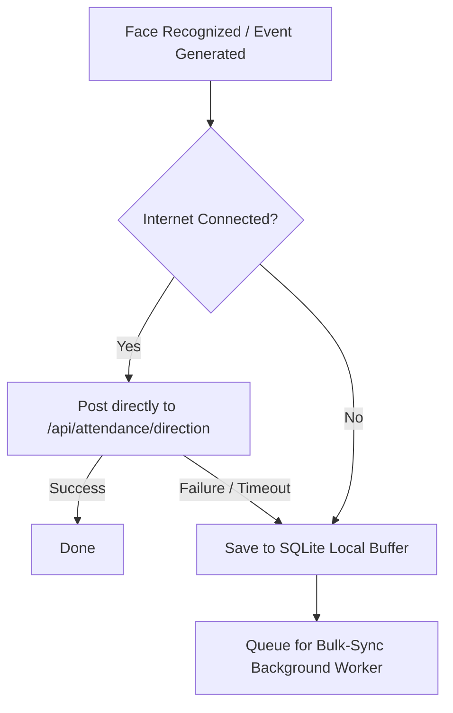

# Edge Node Offline Buffering & Resilience Architecture

## Overview

In enterprise deployments of the Facial Recognition System (FRS), Edge Nodes (LPUs/Jetson devices) are deployed on-site and must continue to operate reliably even when WAN/internet connectivity is lost. This document details the offline resilience architecture, including:

1. **Local Edge Buffering Strategy** via SQLite.
2. **Backend Synchronization Endpoint** (`POST /api/attendance/bulk-sync`).
3. **Retry with Exponential Backoff** and recovery protocols.

---

## 1. Edge-Side Buffer Strategy (SQLite)

When an Edge Node detects a network failure or a heartbeat timeout, it shifts from **real-time streaming** to **offline buffered operations**. 

### Schema of Local SQLite Buffer Table

On each Jetson device, a local SQLite database (`/opt/frs/data/buffer.db`) is initialized with the following structure:

```sql
CREATE TABLE IF NOT EXISTS attendance_buffer (
  id INTEGER PRIMARY KEY AUTOINCREMENT,
  employee_id INTEGER NOT NULL,
  direction TEXT CHECK(direction IN ('in', 'out')) NOT NULL,
  track_id INTEGER,
  device_id TEXT NOT NULL,
  timestamp TEXT NOT NULL,
  confidence REAL DEFAULT 0,
  photo_path TEXT,
  synced INTEGER DEFAULT 0, -- 0 = pending, 1 = synced, -1 = failed permanently
  retry_count INTEGER DEFAULT 0
);
CREATE INDEX IF NOT EXISTS idx_pending_sync ON attendance_buffer (synced, timestamp);
```

### Event Handling Workflow



1. **Real-time Event Generation:**
   - The local recognition engine produces a match.
   - The edge client attempts to submit the event via HTTPS.
2. **Buffer Activation:**
   - If the endpoint returns `5xx`, times out (>5000ms), or is unreachable, the event is immediately stored in `attendance_buffer` with `synced = 0`.
   - The corresponding proof frame/photo is saved locally to `/opt/frs/data/photos/{filename}.jpg`.

---

## 2. Backend Bulk-Sync Endpoint

When connection is restored, the Edge Node uploads its buffered logs in batches to the central server.

### Endpoint Definition

*   **URL:** `/api/attendance/bulk-sync`
*   **Method:** `POST`
*   **Authentication:** Requires valid Device JWT (using client credentials flow) via the `Authorization` header.
*   **Rate Limits:** Protected by the global rate limiter (300 requests / 15 minutes) but optimized to process up to 100 entries per request.

### Request Body Format

```json
{
  "events": [
    {
      "employeeId": 142,
      "direction": "in",
      "trackId": 8593,
      "deviceId": "JETSON-ENTRY-01",
      "timestamp": "2026-05-24T10:15:30Z",
      "confidence": 0.941
    },
    {
      "employeeId": 88,
      "direction": "out",
      "trackId": 8596,
      "deviceId": "JETSON-ENTRY-01",
      "timestamp": "2026-05-24T10:20:12Z",
      "confidence": 0.892
    }
  ]
}
```

### Response Body Format (200 OK)

The backend processes the batch atomically per-record to prevent a single corrupted transaction from discarding the entire sync payload.

```json
{
  "success": true,
  "processed": 2,
  "syncedCount": 2,
  "failedCount": 0,
  "results": [
    { "employeeId": 142, "success": true, "recordId": 3820 },
    { "employeeId": 88, "success": true, "recordId": 3821 }
  ]
}
```

---

## 3. Recovery & Reconciliation Protocols

Once internet connectivity is restored, the Edge Node executes the reconciliation flow:

### Background Sync Worker Loop

1. **Network Health Probe:**
   - The Edge Node continues sending lightweight heartbeats (`POST /api/devices/{deviceId}/heartbeat`).
   - If the heartbeat returns `200 OK`, the sync loop is triggered.
2. **Batched Uploads:**
   - Select up to 50 pending records: `SELECT * FROM attendance_buffer WHERE synced = 0 ORDER BY timestamp ASC LIMIT 50`.
   - Submit batch to `/api/attendance/bulk-sync`.
3. **Reconciliation:**
   - For every entry marked as successful in the response, delete the row from SQLite, or mark `synced = 1`.
   - If a record fails permanently (e.g. `422` due to deleted/unknown employee), mark `synced = -1` (requires manual supervisor inspection).
   - If the batch fails due to network breakdown, retry with **Exponential Backoff**:
     $$\text{Retry Delay} = \min(2^{\text{retry\_count}} \times 5 \text{ seconds}, 300 \text{ seconds})$$
4. **Local Cleanup / Data Retention:**
   - Clean up synced rows and physical photos older than 30 days automatically on the device to manage disk utilization.
