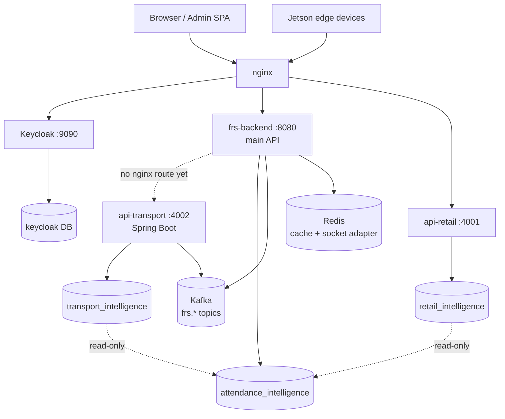
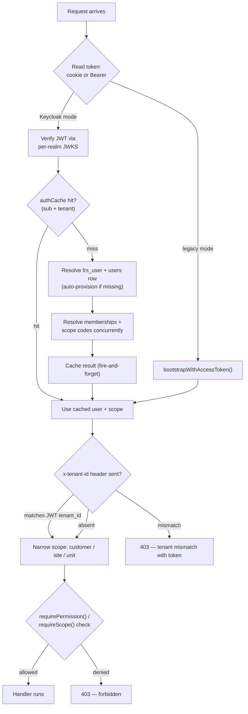
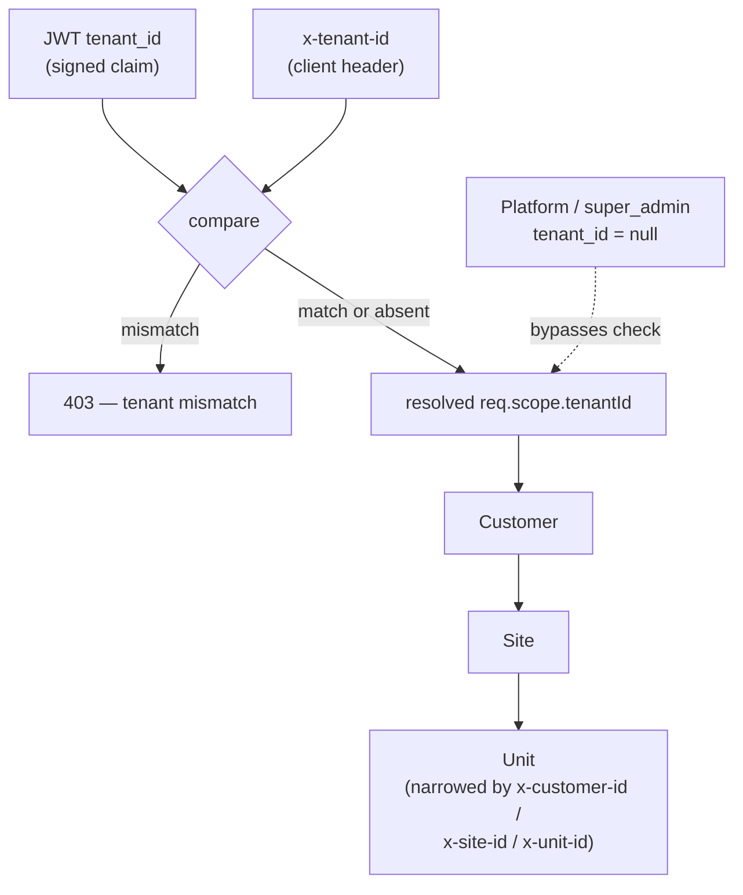
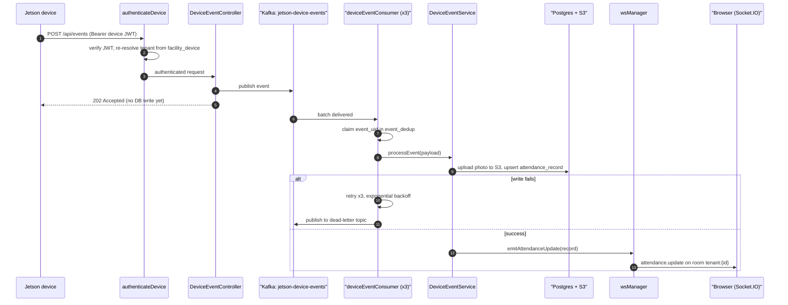

# FRS Backend Architecture

System reference, traced directly from source — `backend/api/src`, `backend/api-retail`, `backend/api-transport`, `infra/` — against branch `feature/rbac-scope-unification`, 2026-08-20.

How a face gets recognized at an edge camera, becomes an attendance record, and reaches a browser in real time — across three backend services, a row-level multi-tenant database, and a Kafka event bus. Every claim below is anchored to a file in the repo, including the parts that are half-migrated or quietly disabled.

**At a glance:** 3 backend services · 44 route files in the main API · 13 Kafka topics in active use · 2 tenant-isolation models mid-migration.

**Legend used throughout:** 🟢 Live · 🔴 Disabled / dead · 🟡 In-progress migration · ⚪ Structural note (not good/bad, just worth knowing)

## Table of contents

1. [Topology](#1-topology)
2. [Request lifecycle & middleware](#2-request-lifecycle--middleware)
3. [Auth, session & RBAC](#3-auth-session--rbac)
4. [Multi-tenancy & data layer](#4-multi-tenancy--data-layer)
5. [Recognition pipeline](#5-recognition-pipeline)
6. [Kafka & background jobs](#6-kafka--background-jobs)
7. [Retail & transport verticals](#7-retail--transport-verticals)
8. [Deployment](#8-deployment)
9. [Findings — what to know before you touch this system](#9-findings--what-to-know-before-you-touch-this-system)

---

## 1. Topology

One nginx instance terminates TLS and fans requests out by path prefix to four upstreams: Keycloak (identity), the main API (everything product-facing), and two newer vertical services that each own their own database and read the main database only for cross-vertical lookups.

| Service | Stack | Port | Database | Purpose |
|---|---|---|---|---|
| `frs-backend` | Node 22 / Express, ESM | `8080` | `attendance_intelligence` | Core product — auth, attendance, devices, HR, RBAC, tenant admin. Everything except retail/transport. |
| `api-retail` | Node / Express | `4001` | `retail_intelligence` | Footfall / occupancy / store-analytics vertical; read-only cross-link back to the main DB for user/tenant lookups. |
| `api-transport` | Java 17 / Spring Boot | `4002` | `transport_intelligence` | Bus/depot/route management, passenger enrollment & boarding events. Newest vertical; not yet in the nginx config. |
| Keycloak | Keycloak 26 | `9090` | `keycloak` | Identity provider — one dedicated realm provisioned per tenant, plus Keycloak 26 "Organizations" for sub-tenant grouping. |



*Fig. 1 — Edge routing and per-service data ownership. `api-transport` has no nginx `location` block yet; `api-retail` and `api-transport` each hold a read-only link back into `attendance_intelligence` rather than owning tenant/user data themselves.*

---

## 2. Request lifecycle & middleware

Every request to the main API (`backend/api/src/server.js`) passes through the same fixed pipeline before it reaches a route handler.

| # | Middleware | Does |
|---|---|---|
| 1 | `trust proxy` | Trusts nginx as the sole reverse proxy for `req.ip` / `X-Forwarded-*`. |
| 2 | `correlationId` | Attaches/propagates `X-Request-ID` across the request and downstream logs. |
| 3 | `requestLogger` | Structured JSON request/response logging (method, path, status, duration). |
| 4 | `cookieParser` | Parses the httpOnly session cookies used for the human auth flow. |
| 5 | `helmet` | Security headers, HSTS (1yr, includeSubDomains, preload). |
| 6 | `cors` | Custom origin check: same-origin / no-Origin allowed; in prod, only `APP_URL` and its tenant subdomains match. |
| 7 | `express.json` (per-route) | Body-size limits set per prefix — 1MB for auth/live/me/users, 10MB for enroll/HRMS/events, raw `image/*` accepted on the catch-all. |
| 8 | `globalRateLimiter` | 600 req / 10 min per IP on `/api`, exempting device-ingest paths (they have their own per-device limiter). |
| 9 | route mount | ~44 routers mounted under `/api/*`. `extractScope` runs pre-auth here for a couple of routes that need scope before `requireAuth`. |
| 10 | `securityEventLogger` | Mounted *after* routes so `req.auth` is populated; logs every 401/403/429 to `audit_log`. |

The HTTP server also carries endpoints that aren't routers at all: `/api/health`, `/api/metrics`, `/api/health/live`/`ready` are defined inline in `server.js`, and `/uploads` is a static mount gated by five middlewares in sequence (`requireAuth → validateScopeAccess → requirePermission('attendance.read') → rate-limit → verifyPhotoAccess`) after a documented incident where it was briefly unauthenticated.

### Route domains

| Domain | Representative routes | Notes |
|---|---|---|
| Identity | `authRoutes`, `mfaRoutes`, `deviceTokenRoutes` | Login, MFA, device JWT rotation. |
| Org & admin | `appAdminRoutes`, `tenantAdminRoutes`, `rbacRoutes`, `siteManagementRoutes` | Super-admin tenant CRUD, tenant-scoped admin, roles/permissions. |
| Device & edge | `deviceRoutes`, `deviceEventsRoutes`, `deviceManagementRoutes`, `jetsonRoutes`, `faceSyncRoutes`, `cameraRoutes`, `bootstrapRoutes` | The Jetson-facing surface — see §5. |
| People & HR | `employeeRoutes`, `hrRoutes`, `studentsRoutes`, `peopleRoutes` | `peopleRoutes` (visitor/unknown-person) is beta-gated behind an allowlist. |
| Attendance & events | `attendanceRoutes`, `faceRoutes`, `alertRoutes`, `incidentRoutes`, `watchlistRoutes`, `confidenceReviewRoutes` | Marking, review queues, incident/watchlist management. |
| Search, reports, live | `searchRoutes`, `reportRoutes`, `liveRoutes`, `dashboardRoutes`, `monitoringRoutes` | Read-side aggregate queries for the frontend. |
| Integration & infra | `hrmsIntegrationRoutes`, `internalRoutes`, `manifestRoutes`, `configRoutes`, `swaggerRoutes`, `healthRoutes` | `internalRoutes` is shared-secret gated, service-to-service only. |

### Route → controller → service → repository

Not universal: 13 of the 44 route files delegate to a `Controller` class in `controllers/`; the rest (auth, HR, RBAC, live, monitoring…) implement handlers inline in the route file. Where a controller exists, the pattern is consistent — traced here for attendance marking:

1. `routes/attendanceRoutes.js` — `router.post("/mark", requirePermission("attendance.write"), AttendanceController.markAttendance)`
2. `controllers/AttendanceController.js` — zod-validates the body, calls the service with `scope: scopeHeaders(req)`, then purges the `/live` API cache.
3. `services/business/AttendanceService.js` — business logic; builds its WHERE clause via `repositories/scopeSql.js: buildScopeWhere()` — the actual point where a resolved auth scope becomes a SQL predicate.
4. `repositories/eventRepository.js` / `liveRepository.js` — parameterized SQL against the shared pool.

---

## 3. Auth, session & RBAC

Auth mode is a single env switch (`AUTH_MODE=keycloak` vs `api`). Keycloak is the production path: OIDC login, per-realm JWKS verification, and a signed `tenant_id` claim that becomes the one non-negotiable trust boundary in the system. A legacy local-bcrypt path still compiles in when Keycloak mode is off.

| Endpoint | Mode | Does |
|---|---|---|
| `POST /api/auth/login` | legacy only | Email+password → session cookies, or an MFA challenge token if TOTP is enabled. |
| `GET /api/auth/bootstrap` | both | Resolves the current session into user + memberships + resolved scope; in Keycloak mode also assembles the "mt" bundle (vertical, scope codes, plan features). |
| `POST /api/auth/keycloak-login` | keycloak | Server-side ROPC proxy to Keycloak's token endpoint — the browser never talks to Keycloak directly, keeping client secrets server-side. |
| `POST /api/auth/mfa/verify` | both | Second step after login: validates a short-lived challenge token plus a TOTP or backup code, then issues the real session. |
| `GET/POST /api/auth/invite/:token` | both | Public invite-acceptance flow; sets the initial password and, in Keycloak mode, provisions the Keycloak account inline. |

Sessions are httpOnly / `secure` / `sameSite: strict` cookies (`access_token`, `refreshToken`). Keycloak-mode reads prefer a Bearer header first, cookie second; legacy mode is the reverse.

### Permission model — two systems, one migration away from unifying

| | Legacy — `requirePermission()` | New — `requireScope()` / `requireFeature()` |
|---|---|---|
| Backing data | Hardcoded `ROLE_PERMISSIONS` map (6 roles → dotted permission strings), checked against Keycloak realm roles or DB memberships | `req.auth.mt.scopeCodes`, resolved via the `scopes` table joined through `role_scope_mapping` |
| Granularity | Action-level (`"attendance.write"`) | Menu-anchored (`menu_name` / `sub_menu` / `action`) |
| Used by | Most of the 44 route files today | Newer routes (`studentsRoutes`, plan-gated endpoints) |

**Bridge:** `backend/api/scripts/generate-permission-scope-crosswalk.js` (new, untracked) statically parses every route's `requirePermission()` call and matches it against the `scopes` table, writing `docs/api/Permission_Scope_Crosswalk.xlsx` as a human-reviewed prerequisite for a later phase that replaces the legacy guard everywhere.



*Fig. 2 — `requireAuth` resolution. The signed JWT's `tenant_id` claim is the only source of truth for which tenant a request belongs to; a client-sent `x-tenant-id` header can only narrow within it or be rejected, never escalate it.*

> **🟡 In progress — `feature/rbac-scope-unification`: what this branch is actually doing**
>
> Zero commits ahead of `dev` — the work is entirely in the uncommitted working tree (6 files, 32/24 lines) plus the crosswalk script above. The shape of it: the database is mid-migration from an int-keyed `roles` / `role_scope_mapping` pair to a UUID-keyed `rbac_role` table. Every insert site touching `user_role` / `group_role_map` across `tenantAdminRepository.js`, `tenantRepository.js`, `userRepository.js`, `rbacRoutes.js`, and `provisionUser.js` now also populates `fk_role_id_uuid` via a lookup join, so the legacy int FK and the new UUID FK stay in sync during the transition — a dual-write, not a cutover. `services/multitenant.js` was updated in parallel to read from `rbac_role` instead of `roles`. A pre-migration DB backup (`rbac_pre_phase0_20260820_075851.sql.gz`) is already sitting in `infra/native-deploy/backups/`.

> **🔴 Dev-only, but sharp — permission checks fully bypass in development**
>
> `requirePermission()` skips its check entirely when `NODE_ENV=development`, and `requireAuth` will synthesize a super-admin identity if token/scope resolution fails under the same condition. Worth a deliberate look at whatever sets `NODE_ENV` in every deployed environment — this is the kind of gate that's only ever wrong once.

---

## 4. Multi-tenancy & data layer

A single Postgres pool (`db/pool.js`, default max 20 connections, TCP keepalive, one transparent retry on a transient connection error) backs the whole main API — no read/write replica split. Tenant isolation is a `tenant_id` column, not schema-per-tenant or separate databases, and it's enforced by every repository parameterizing its own `WHERE tenant_id = $1` (usually via the shared `buildScopeWhere()` helper) — **not by the database.**

> **🔴 Finding — Postgres RLS exists in the schema but isn't exercised**
>
> Two generations of Row-Level Security policy live in `001_init_schema.sql` — 5 legacy policies keyed on `current_setting('app.tenant_id')`, and 34 newer `tenant_isolation_policy` rules keyed on `app.current_tenant_id`. The only function that ever sets those session variables, `withTenantContext()`, is called nowhere outside its own file. In practice, RLS is dormant defense-in-depth; isolation today is 100% the application-level `tenant_id` predicates described above.



*Fig. 3 — Scope resolution and containment. One Keycloak realm exists per tenant; the realm's Protocol Mapper bakes `tenant_id` into every token it mints, which is what makes the claim trustworthy enough to lock the boundary on.*

### Keycloak realm provisioning (new tenant)

1. **Outside any DB transaction:** `provisionDedicatedRealm()` creates the realm (branding, session/lockout/password policy, the public `attendance-frontend` client, and the six default realm roles), then creates the admin user and a Keycloak Organization for the tenant.
2. If any Keycloak step fails after the realm was created, it's hard-deleted as compensation — a tenant-creation failure never leaves an orphaned realm behind.
3. **One Postgres transaction:** inserts the tenant row, subscription, UI config, realm-slug row, default groups/roles, and the admin-user mapping.

### Migrations & embeddings

36 migration files (`001`–`026`, several numbers reused across parallel branches). The most recent ten are almost entirely navigation/menu seed data for the Transport and Retail verticals, not core schema changes. `pgvector` backs `employee_face_embeddings.embedding vector(512)` and the education-tier equivalent, with a parallel AES-256-GCM `encrypted_embedding` column added later.

---

## 5. Recognition pipeline

**Two pipelines exist in this code. One is live.**

Before anything else: `backend/api/src` contains a generic RTSP-camera / OpenVINO-ONNX rules-engine framework (`core/managers`, `core/services/InferenceProcessorCore`, `core/workers/InferenceWorker`, `core/rules/*`) that reads as production code but is stubbed out at the two lines that matter in `server.js`:

```js
// import modelManager from "./core/managers/ModelManager.js"; // disabled until Jetson online
const modelManager = { initialize: async()=>{} };
```

The real traffic path is entirely different code: `routes/deviceEventsRoutes.js → DeviceEventService → Kafka → workers/deviceEventConsumer.js → Postgres/pgvector → Socket.IO`. `onnxruntime-node` is a declared dependency that is never imported anywhere in `src` — every model call happens outside this Node process (see the table below).

### Live path — device already matched the face (common case)



*Fig. 4 — The ingest endpoint only authenticates, validates, and publishes; it returns `202` before any database write. All the real work — dedup, S3 upload, attendance upsert, broadcast — happens in a standalone `deviceEventConsumer` PM2 process, decoupled from the HTTP request entirely.*

**Path 2 — server-side matching** (less common): a device or admin tool sends a raw embedding or image to `POST /api/face/recognize`. `FaceController.recognizeAndMark` runs a pgvector cosine-distance nearest-neighbor query against `employee_face_embeddings` (threshold 0.42, falling back to `person_face_embeddings` at 0.55 for visitor matching), then calls `AttendanceService.markAttendance()` — a second, independently-maintained write path that converges on the same `wsManager.emitAttendanceUpdate` as Path 1, but through different code.

### Where inference actually runs

| Stage | Runs where | Notes |
|---|---|---|
| Primary match | On the Jetson device | On-device ArcFace/YOLO (e.g. `arcface-r50-fp16`); firmware isn't in this repo. Devices pull embeddings via `GET /api/face/sync/embeddings` every ~60s. |
| Embedding fallback | `face_quality_service.py`, `127.0.0.1:5050` | Python Flask + InsightFace (`buffalo_sc`), CPU ONNX Runtime — used when a device sends a crop instead of a resolved match, and for enrollment-photo quality scoring. |
| Similarity search | Postgres, pgvector `<=>` operator | Cosine distance against stored embeddings — the one inference-adjacent step that genuinely happens inside the main API's own database. |

### Real-time delivery — Socket.IO across processes

Rooms are per-tenant (`tenant:{id}`), joined client-side after the socket handshake verifies the same JWT/cookie as the HTTP path. Because attendance events are often emitted from the standalone `deviceEventConsumer` process rather than `frs-backend` itself, cross-process delivery goes through Redis: processes that own real Socket.IO connections attach `@socket.io/redis-adapter`; processes that don't (the Kafka consumer workers) publish through `@socket.io/redis-emitter` instead — both speak the same Socket.IO wire protocol over the same Redis pub/sub channel, so every process gets an identical `.to(room).emit()` interface regardless of whether it holds any live connections.

### Dead / disabled, but present in the tree

- 🔴 **OpenVINO/ONNX rules engine** — `core/managers`, `InferenceProcessorCore`, `InferenceWorker`, `core/rules/*`. Scaffolding ported from a Java reference implementation; stubbed to no-ops in `server.js`. `InferenceWorker.js` is a `worker_threads` file that's never actually spawned anywhere.
- 🔴 **`core/db/FaceDB.js`** — a legacy SQLite face store backing `/api/face/register`, `/verify`, `/search`, `/groups` in parallel to the real Postgres/pgvector tables the live pipeline actually uses.
- 🔴 **`LivePresenceService.js`** — an in-memory presence tracker, wired at startup but never fed by the real event pipeline. `/api/live/*` reads Postgres directly, bypassing it entirely.

---

## 6. Kafka & background jobs

| Topic | Producer | Consumer | Purpose |
|---|---|---|---|
| `jetson-device-events` | `DeviceEventController` | `deviceEventConsumer` (x3, standalone) | Raw Jetson face/attendance events — the live pipeline's spine. |
| `attendance-ingest` | `attendanceIngestPublisher` | `attendanceIngestWorker` (in-process) | Write-behind attendance from the REST/embedding path, keyed by employeeId. |
| `device-events` / `ai-detections` | various rule/detection services | `frs-backend` (in-process, forwards to WS) | Live dashboard forwarding. |
| `transport-realtime` | `api-transport` (Java) | `transportRealtimeConsumer` (standalone) | Bus-occupancy updates relayed into `wsManager.broadcastToTenant()`. |
| `events` / `detections` / `alerts` / `smart-search(-results)` / `system-metrics` | rule engine, snapshot & search services | `KafkaEventService` subscribers | General firehose for the (partly disabled) detection pipeline and smart search. |
| `dead-letter` | any consumer's `routeToDeadLetter()` | `deadLetterMonitor` (standalone, log-only) | Poison messages after 3 retries — visibility only, no auto-retry. |

⚪ 10 of these are pre-created by `scripts/create-topics.js`; `jetson-device-events`, `attendance-ingest`, and `transport-realtime` rely on `allowAutoTopicCreation` instead and so get default, uncontrolled partitioning.

### PM2 process topology

| Process | Entry point | Mode |
|---|---|---|
| `frs-backend` | `src/server.js` | cluster, 2–3 instances — only instance 0 runs cron jobs |
| `frs-device-event-consumer` | `src/workers/deviceEventConsumer.js` | fork ×3 |
| `frs-dead-letter-monitor` | `src/workers/deadLetterMonitor.js` | fork ×1 |
| `frs-transport-realtime-consumer` | `src/workers/transportRealtimeConsumer.js` | fork ×1 |
| `frs-retail-backend` | `api-retail/src/index.js` | separate service |
| `frs-transport-backend` | `api-transport/start.sh` | separate service (JVM) |

No `ecosystem.config.*` is checked into the repo — this topology comes from ad-hoc `pm2 start` calls in `deploy.sh` plus in-code comments.

### Cron / interval jobs

| Job | Interval | Does |
|---|---|---|
| `deviceOfflineCron` | 60s | Marks devices offline on stale heartbeat, cascades to child cameras, broadcasts over WS. |
| `dataRetentionCron` | 24h | GDPR/retention purge — embeddings, attendance, audit log, device events, search history. |
| `enrollmentReminderCron` | 15min | Reminder emails for unfinished enrollment, timed to each site's local hour. |
| `aiDriftMonitorCron` | 7d | Compares 7-day recognition accuracy against the last snapshot; flags drift >3%. |
| `photoPurgeCron` | — | 🔴 Disabled — no-op since photos moved to permanent S3 storage. |

None of these use the `node-cron` dependency — all are plain `setInterval` loops, and all are gated to PM2 cluster worker 0 so they run exactly once regardless of instance count.

---

## 7. Retail & transport verticals

### `api-retail` 🟢 Live — Node / Express

- **Purpose:** People-counting, occupancy, and store-analytics — footfall via in-store cameras.
- **Auth:** Same Keycloak JWT verification as the main API, plus its own device-JWT flow.
- **Data:** `retail_intelligence`, own DB; read-only link to `attendance_intelligence` for user/tenant lookups.
- **Routing:** nginx `/api/v1/retail/`, plus a dedicated SSE location for the live snapshot stream.

### `api-transport` 🟢 Live — Java 17 / Spring Boot

- **Purpose:** Bus/depot/route management, passenger face enrollment, and on-vehicle boarding-event ingestion.
- **Auth:** Custom `SecurityFilterChain` — Keycloak JWT verification (JJWT) plus a parallel device-auth filter, reimplementing the main API's scope model as `TransportScope`.
- **Data:** `transport_intelligence` via Spring Data JPA + Flyway; a read-only datasource back into the FRS DB mirrors the retail pattern.
- **Routing:** No nginx location block yet — the newest of the three services.

---

## 8. Deployment

| Path prefix | Upstream |
|---|---|
| `/auth/` | Keycloak, `127.0.0.1:9090` |
| `/api/v1/retail/*` | api-retail, `127.0.0.1:4001` (incl. a dedicated SSE location for the snapshot stream) |
| `/api/`, `/socket.io/`, `/uploads/` | frs-backend, `127.0.0.1:8080` |
| `/` (everything else) | Frontend SPA static build |

The repo carries two parallel deployment strategies under `infra/`: a containerized path (`infra/docker` — docker-compose for Postgres, Kafka, Keycloak, backend, frontend) and a bare-metal path (`infra/native-deploy` — nginx/PM2/Postgres setup scripts, plus `infra/keycloak-native` for a systemd-managed Keycloak outside Docker). Both are present and maintained; which one is authoritative for a given environment is a deployment-time decision, not something the code itself picks.

---

## 9. Findings — what to know before you touch this system

| | Finding |
|---|---|
| 🔴 Disabled | **The OpenVINO/ONNX rules-engine layer is dead code that reads as live.** `core/managers`, `InferenceProcessorCore`, `InferenceWorker`, `core/rules/*` — fully scaffolded, stubbed to no-ops in `server.js`. Easy to mistake for the real pipeline; it isn't. |
| 🔴 Disabled | **`FaceDB.js` is a second, SQLite-backed face store**, parallel to the Postgres/pgvector tables the live pipeline uses, still wired to several `/api/face/*` endpoints. |
| 🔴 Disabled | **`LivePresenceService` is unused by the real event flow.** Wired at startup, never fed by `DeviceEventService`. `/api/live/*` reads Postgres directly instead. |
| 🔴 Finding | **Postgres RLS is inert.** 39 RLS policies exist across two tenant models; the only code that sets the session GUCs they depend on, `withTenantContext()`, is never called from a request. Isolation is application-code only, today. |
| ⚪ Structural | **Two independent attendance-write paths.** `DeviceEventService.handleFaceRecognized` (Jetson pipeline) and `AttendanceService.markAttendance` (embedding/API + Kafka ingest-worker path) each UPSERT `attendance_record` separately and only converge at the Socket.IO broadcast — not at a shared write function. |
| 🟡 In progress | **RBAC role tables are mid dual-write migration.** `feature/rbac-scope-unification` is unifying an int-keyed `roles` table into a UUID-keyed `rbac_role` table, all as uncommitted working-tree changes right now. |
| 🔴 Dev-only | **`NODE_ENV=development` bypasses permission checks entirely**, and can synthesize a super-admin identity if auth resolution fails. Confirm this can't be reached in any deployed config. |
| ⚪ Gap | **3 of 13 Kafka topics rely on auto-creation.** `jetson-device-events`, `attendance-ingest`, `transport-realtime` aren't in `scripts/create-topics.js` — they get default, uncontrolled partitioning on first publish. |

---

*Compiled by tracing `backend/api/src`, `backend/api-retail`, `backend/api-transport`, and `infra/` against the `feature/rbac-scope-unification` branch, 2026-08-20. A rendered, navigable version of this same content is published at the artifact linked in this conversation.*
